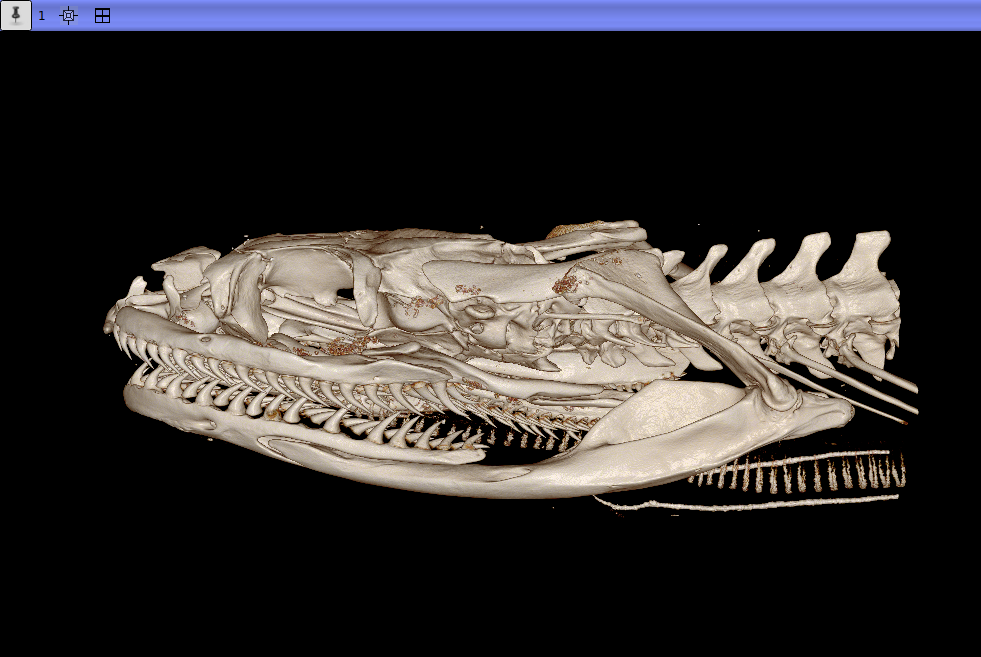

# Nerodia Segmentation Laboratory
## This lab is designed to introduce students to segmentation using 3DSlicer and allow an instructor to easily assess a students work. 
* Using MorphoDepot, students will be assigned a bone in the skull of N. rhombifer to segment.
* The instructor will provide a demonstration of how to access the data and the various segmentation tools available.
* Students will be asked to complete their segmentation in class or at home and submit it to the instructor for grading. 

## Specimen Specifications
* Species: Nerodia rhombifer
* Specimen ID: AHS-L6865
* Scanning Facility: Utah State University
  * Technician: Lauren Houstoun
* Modality: Micro CT (or synchrotron)
* Contrast: No
* Dimensions: (762, 1305, 2097)
* Spacing (mm): (0.02469999999999999, 0.024699999999999972, 0.024699999999999982)

## Images of 3D Estimate in 3D Slicer

|  |  |
|---|---|
| 
<em>Dorsal view of N. rhombifer</em>
 | 
<em>Lateral view of N. rhombifer</em>
 |

Repository for segmentation of a specimen scan.  See [this JSON file](MorphoDepotAccession.json) for specimen details.
