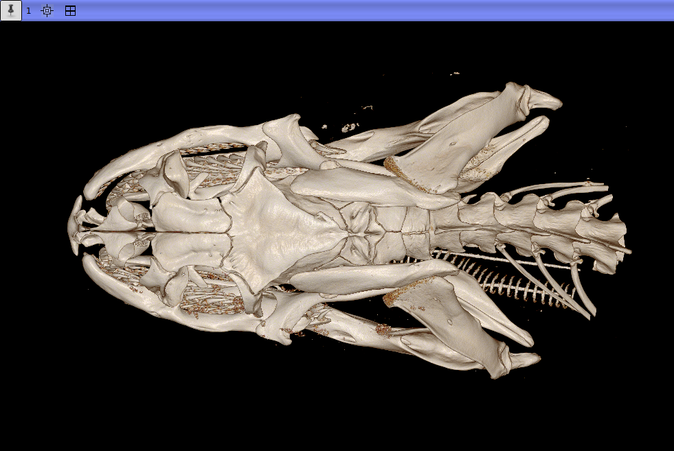

## MorphoDepot Repository
Repository for segmentation of a specimen scan.  See [this JSON file](MorphoDepotAccession.json) for specimen details.
* Species: Nerodia rhombifer
* Modality: Micro CT (or synchrotron)
* Contrast: No
* Dimensions: (762, 1305, 2097)
* Spacing (mm): (0.02469999999999999, 0.024699999999999972, 0.024699999999999982)

## Screenshots

_Dorsal view of N.rhombifer_

_Lateral view of N.rhombifer
_
